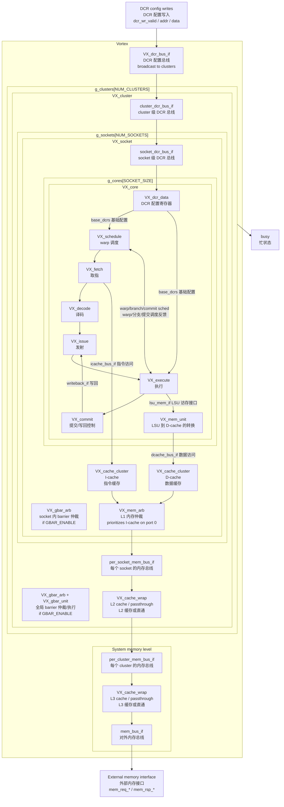

# Vortex RTL Hierarchy

This diagram is a first-pass reading map for `hw/rtl/Vortex.sv`. It keeps the main module boundaries and data paths visible without expanding every parameterized instance.

这张图是阅读 `hw/rtl/Vortex.sv` 的第一版地图。它只保留主要模块边界和关键数据路径，不展开所有参数化实例和内部细节。

## Suggested Reading Order

建议按这个顺序阅读源码：

1. `hw/rtl/Vortex.sv`: top-level memory ports, DCR bus, L3, cluster generation.
2. `hw/rtl/VX_cluster.sv`: L2 cache and socket generation.
3. `hw/rtl/VX_socket.sv`: I-cache, D-cache, L1 arbitration, core generation.
4. `hw/rtl/core/VX_core.sv`: pipeline stages and the LSU memory path.
5. `hw/rtl/core/VX_execute.sv`: ALU/LSU/FPU/TCU/SFU dispatch.
6. `hw/rtl/core/VX_mem_unit.sv`: LSU requests into the D-cache bus.

中文对照：

1. `hw/rtl/Vortex.sv`：顶层内存端口、DCR 配置总线、L3 缓存、cluster 生成。
2. `hw/rtl/VX_cluster.sv`：L2 缓存和 socket 生成。
3. `hw/rtl/VX_socket.sv`：I-cache、D-cache、L1 内存仲裁、core 生成。
4. `hw/rtl/core/VX_core.sv`：核心流水线阶段，以及 LSU 访存路径。
5. `hw/rtl/core/VX_execute.sv`：ALU、LSU、FPU、TCU、SFU 的执行单元分发。
6. `hw/rtl/core/VX_mem_unit.sv`：LSU 请求如何转换并送到 D-cache 总线。

## Terms

| Term | 中文 | Meaning |
| --- | --- | --- |
| DCR | 设备控制寄存器 | Host or control path writes configuration/state into the device. |
| I-cache | 指令缓存 | Fetch stage reads instructions through this path. |
| D-cache | 数据缓存 | LSU load/store requests go through this path. |
| LSU | 加载/存储单元 | Handles memory operations from execute stage. |
| GBAR | 全局 barrier | Synchronization path enabled by `GBAR_ENABLE`. |
| passthrough | 直通 | Cache wrapper can bypass cache behavior when that cache level is disabled. |
